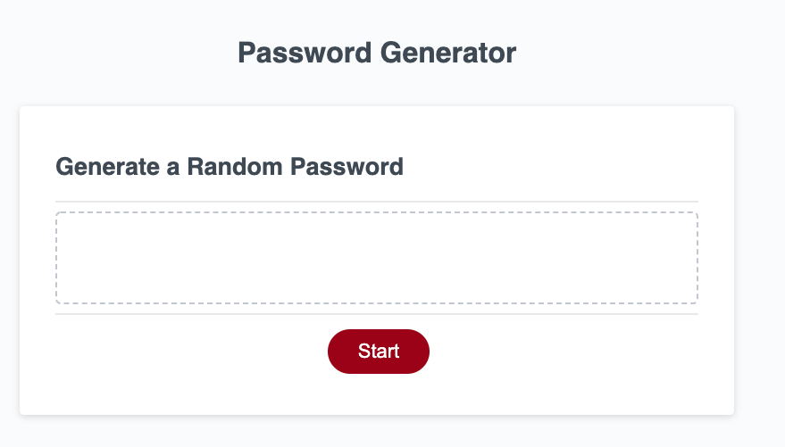

# password-generator
App to take walk the user through steps of generate strong password

Using the object.style.display="none" and "block", simulate steps form. 

Inital state: Present user with an app description and a start button to take them to the next step.

Steps:
1) Slider:
- Present a slider to the user to pick the length
- Set min and max values on the slider
- Validate Slider Value on Next Click

2) Pick Character Types
- use checkboxes to collect char type selection of lowercase, uppercase, numeric, special characters
- set string of characters for each char type
- at least one char type must be selected
- append selected char types into one varable
- iterate over that verable string and pick random characters until reaching max length of the user selected length
- make sure at least one character from each user selected char types is included

3) Present User with the Strong Password
- present user with the password
- allow user to change their password strength options
- allow user to rest the form and start over

The following image demonstrates the web application's appearance:

To view the working app use the link below:

https://elmir123.github.io/password-generator/
